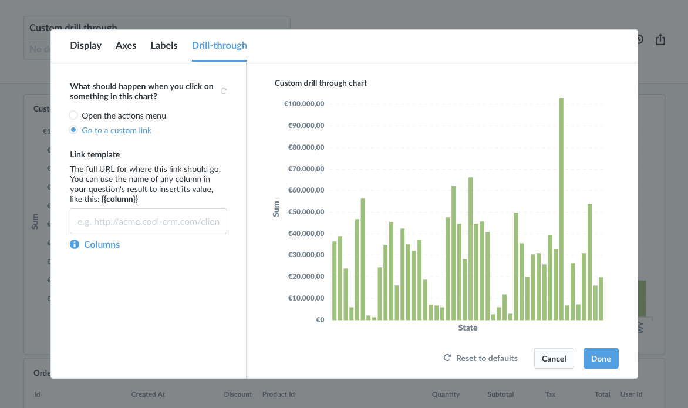
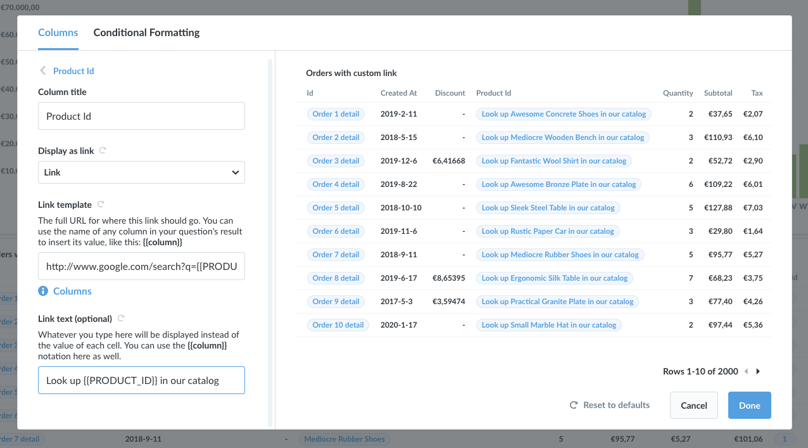

## Customizing drill-through

Out of the box, Metabase comes with some handy actions that you can access when you click on parts of a table or chart: you can filter, break out, zoom in, or x-ray on the thing you click.

But the Enterprise Edition of Metabase includes a set of features which allow you to customize what happens when you click on things.

For example, you might have a high-level executive dashboard with a bar chart which shows your total revenue per product category, and what you’d like to do is allow your users to click on a bar in that chart to see a *different* dashboard with more detail about that product category.

Or maybe you have a similar scenario, but you’d like to set things up so that clicking on a bar takes your users to a totally different app or site, like an internal company wiki page.

We’ll walk through how to do both of these things. Here’s the chart and table we’ll be using in our examples.

### Customizing drill-through for a chart
We’ll need a chart to start, either in a dashboard or a standalone one. Our example chart displays the sum of revenue received from orders in each state of the US (it looks like Texas really loves Widgets and Gizmos).

Next, we’ll enter edit mode for our dashboard, then click the gear icon on our chart to open up the chart settings. If you’re using a standalone saved question, just click the gear next to the chart type to open up the chart settings.

Click on the `Drill-through` tab at the top and you’ll see two options for what should happen when someone clicks on this chart. The default is that it’ll open up the actions menu, but we want to override this with a custom link, so we’ll click that option. When we do, we see a new Link Template section.

What we need to do here is to type in the full URL of where a user should go when they click on a bar in the chart. But the really powerful thing we can do is to use a variable in the URL which can insert the value of the clicked bar. For example, we could type a URL like this `https://www.google.com/search?q={{STATE}}`.

The important part is the `{{STATE}}` bit — what we’re doing here is referring to the `STATE` column in our query’s result (which we’re using for our x-axis in this case). So if a user was to click on the `TX` (Texas) bar in our chart, the value of the `STATE` column for that bar would be inserted into our URL, so it would look like this: `https://www.google.com/search?q=TX`. If you click on the blue `Columns` link below the input box here, you’ll see the full list of all the columns you can refer to. Your URL can use as many column variables you want; you can even refer to the same column multiple times in different parts of the URL.

Next we’ll click `Done`, then save our dashboard. Now when we click our chart, instead of seeing the actions menu, we’ll be taken to the URL that we entered above, with the value of the clicked bar inserted into the URL. These links will be opened in a new tab or window unless they link to another chart or dashboard within Metabase.

**Note:** One important thing to point out is that when we customize drill-through on a dashboard card, rather than on the standalone saved question, we’re only customizing for that instance of the chart on that one dashboard.

### Customizing drill-through for a column in a table

Customizing drill-through for a table is very similar. Usually what we’re trying to do with a table though is to make it so that clicking on a cell in a specific column will go to a custom destination. E.g., I might have a `Product ID` column, and I’d like to make it so that clicking on a specific product's ID will open up my product catalog web app to the page that has details for the product I clicked on.

Again, in our example our table visualization is in a dashboard, so we’ll start by entering edit mode for our dashboard and then clicking the settings gear button on our table. If you were doing this on a standalone question, you’d click the gear button next to the visualization dropdown.

From the `Columns` tab I'll find my `Product ID` column and click the gear next to it.

Then I'll find the `Display as link` setting. This dropdown will be slightly different depending on what kind of column you're customizing; for example, Email or URL columns will have additional options for how they should be displayed in the table. For our purposes, we'll open the dropdown and select the `Link` option.

We'll now see the same link template input box as with the chart example above. Just as before, we can use the double braces syntax, like `{{PRODUCT_ID}}`, in our URL to refer to a column name to insert the clicked cell's value at that point in the URL.

Note that you can refer to *any* column in the table here, not just the column whose drill-through behavior you're customizing. When you click on a cell, it will insert the value of all referenced columns *in that same row* into your URL. This could let us do things like make clicking on a product's *name* go somewhere custom, but reference the product's *ID* in the URL.

**Customizing link text**
Additionally, you can optionally customize what text should be displayed in each cell of this column. You can also use the double braces variable syntax here. The way we've used this in the example above is to refer to the value of our `Product ID` column in a sentence that makes it clearer what will happen when the cell is clicked. So `Look up {{PRODUCT_ID}} in our catalog` gets turned into `Look up Awesome Concrete Shoes in our catalog` in the corresponding cell.

---

## That’s it!
If you still have questions about using alerts, you can head over to our [discussion forum](http://discourse.metabase.com/). See you there!
